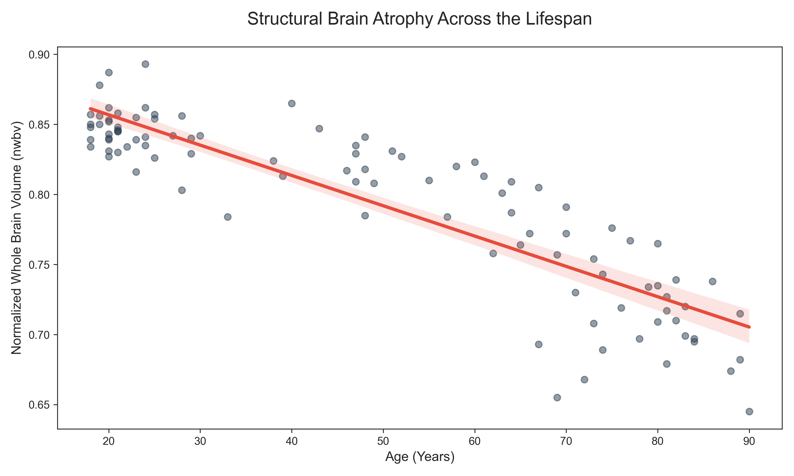
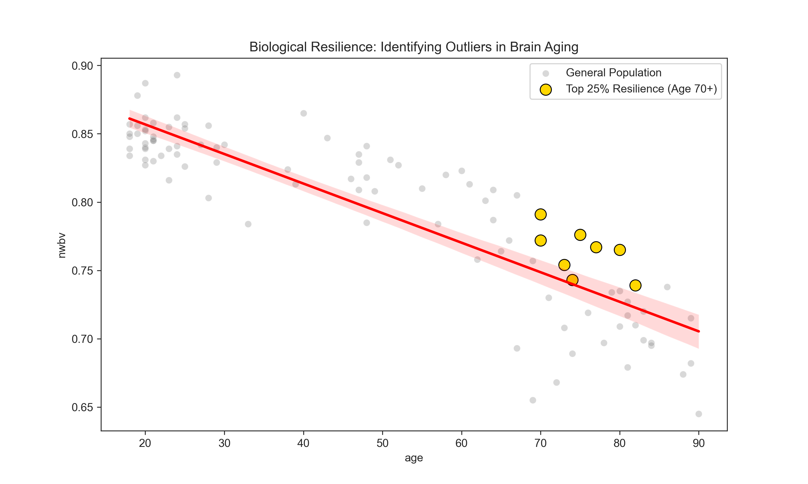
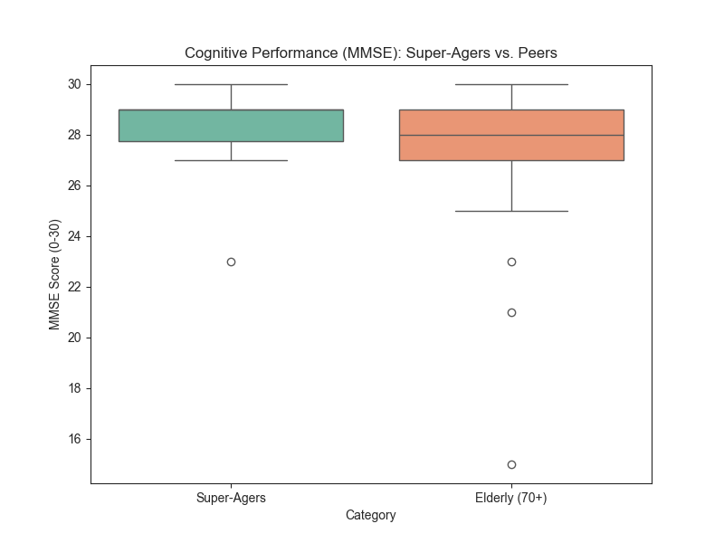

# Neuroimaging Analysis: Quantifying Brain Atrophy & Resilience
An exploratory data science project investigating structural MRI biomarkers of aging using the OASIS-1 dataset.

## Project Overview
This project utilizes Python to analyze the relationship between chronological age and normalized whole-brain volume (nWBV). Beyond simple linear trends, this analysis explores gender-based dimorphism and identifies "Super-Ager" individuals who exhibit high neurological resilience despite advanced age.

## Key Research Findings

### 1. Robust Age-Related Atrophy
The analysis confirmed a strong negative correlation between age and brain volume, with an **R-squared value of 0.78**. This indicates that approximately 78% of the variance in brain volume is explained by chronological aging.

### 2. Gender-Specific Trajectories
Stratified analysis revealed a divergence in aging patterns between biological sexes:
* **Males (r = -0.93):** Exhibited a highly linear and aggressive decline in brain volume.
* **Females (r = -0.85):** Showed slightly more variance, suggesting potential differences in neuroprotective factors.

### 3. Identification of "Super-Agers"
Using a relative resilience threshold, the pipeline identified **8 individuals** (Age 70+) whose brain volumes remained in the top 25th percentile of their cohort.

* **Clinical Validation:** Super-Agers maintained a higher mean cognitive score (**MMSE = 28.0**) compared to their age-matched peers (**MMSE = 27.0**), linking structural resilience to functional cognitive health.

## Tech Stack
* **Language:** Python 3.12
* **Data Science:** `Pandas`, `NumPy`, `Scikit-Learn`
* **Neuroimaging Tools:** `Nilearn` (OASIS-1 dataset)
* **Visualization:** `Matplotlib`, `Seaborn`

## Repository Structure
* `analysis.py`: Main processing and visualization pipeline.
* `results/`: Contains high-resolution plots of regression, gender comparisons, and heatmaps.
* `README.md`: Project documentation and summary of findings.

